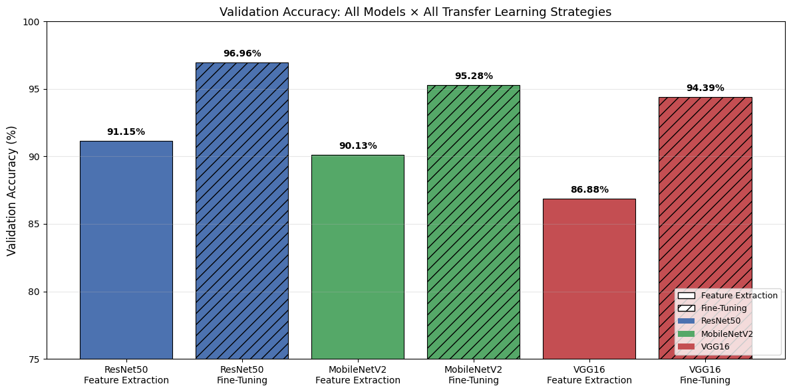
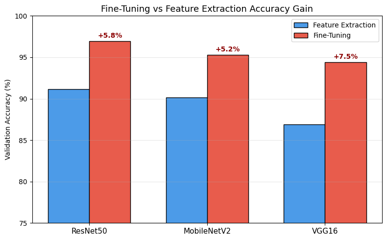
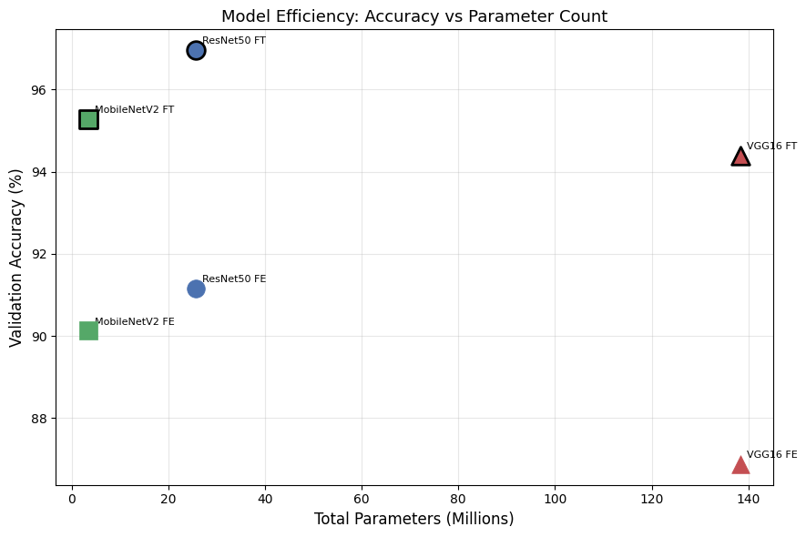
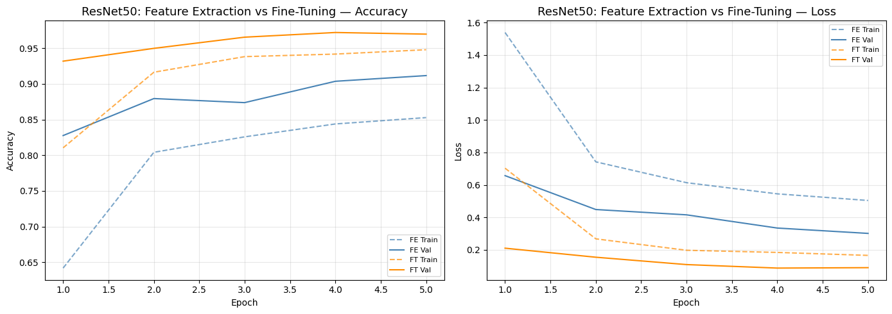
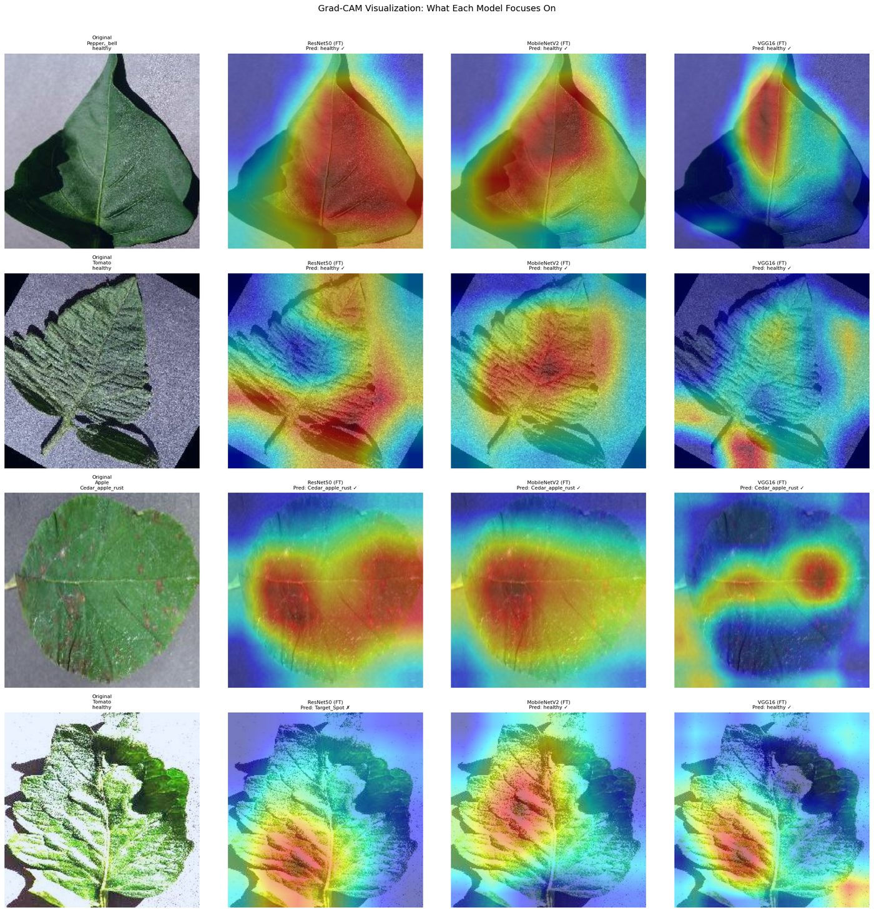

# Plant Disease Classification — Transfer Learning Comparative Study

> 📚 **Course:** Deep Learning — Spring 2026, NUST SEECS

A comparative deep-learning study that classifies **38 plant-disease classes** from leaf images using transfer learning across **three distinct CNN architecture families**, each evaluated under two strategies: **feature extraction** (frozen backbone) and **fine-tuning** (unfrozen upper layers).

Built in PyTorch on the [New Plant Diseases Dataset](https://www.kaggle.com/datasets/vipoooool/new-plant-diseases-dataset) (PlantVillage). CS 419 Deep Learning project, NUST SEECS.

---

## TL;DR — Results

Six experiments, validated on **3,514 images** across 38 classes:

| Rank | Model | Strategy | Val Accuracy | Params | Train time |
|:---:|---|---|:---:|:---:|:---:|
| 🥇 | **ResNet50** | Fine-Tuning | **96.96%** | 25.6 M | 513 s |
| 🥈 | MobileNetV2 | Fine-Tuning | 95.28% | 3.4 M | 406 s |
| 🥉 | VGG16 | Fine-Tuning | 94.39% | 138.4 M | 600 s |
| 4 | ResNet50 | Feature Extraction | 91.15% | 25.6 M | 498 s |
| 5 | MobileNetV2 | Feature Extraction | 90.13% | 3.4 M | 393 s |
| 6 | VGG16 | Feature Extraction | 86.88% | 138.4 M | 572 s |

**Headline findings**
- **Fine-tuning beats feature extraction by 5–8%** on every architecture — plant-disease leaf textures differ enough from ImageNet to require adapting the upper layers.
- **ResNet50 (fine-tuned) is the most accurate** at 96.96%.
- **MobileNetV2 is the efficiency winner** — within ~1.7% of ResNet50 using **7× fewer parameters** (3.4 M vs 25.6 M), making it the practical choice for edge/field deployment.
- **VGG16 is impractical for production**: 138 M parameters (≈40× MobileNetV2) for *lower* accuracy than both.



---

## Why these three architectures

The brief required three CNNs from **different design families**. Each represents a distinct approach to building depth:

| Architecture | Family | Key idea | Params |
|---|---|---|:---:|
| **ResNet50** | Residual Networks | Skip connections solve vanishing gradients, enabling very deep training | ~25.6 M |
| **MobileNetV2** | Efficient / Mobile | Depthwise-separable convolutions + inverted residuals for minimal compute | ~3.4 M |
| **VGG16** | Classic Deep CNN | Depth through uniform stacks of 3×3 convolutions, no skip/depthwise tricks | ~138.4 M |

This spread (residual vs. depthwise-separable vs. plain-stacked) lets the study isolate how architectural choices affect accuracy, training stability, and the accuracy-vs-efficiency trade-off.

---

## Method

**Dataset.** New Plant Diseases Dataset (Kaggle) — 38 classes of healthy/diseased leaves from PlantVillage. To stay within Colab compute limits, a **fixed 20% random subset** (seed = 42) was used, yielding 3,514 validation images.

**Preprocessing.** Images resized to **224×224** (ImageNet input size). Training augmentation: random resized crop, horizontal flip, color jitter. Normalized with ImageNet mean/std.

**Transfer learning — two strategies per model:**
- *Feature extraction:* freeze the entire pretrained convolutional base, train only a new classifier head.
- *Fine-tuning:* additionally unfreeze the upper convolutional block (ResNet `layer4`, MobileNet `features[-4:]`, VGG `features[24:]`) and train it at a lower learning rate (1e-4) than the head (1e-3).

**Identical training setup across all six runs** for fair comparison:

| Setting | Value |
|---|---|
| Loss | CrossEntropyLoss |
| Optimizer | Adam |
| Epochs | 5 per phase |
| Batch size | 64 |
| LR (head / unfrozen) | 1e-3 / 1e-4 |
| Seed | 42 |

---

## Results in detail

### Fine-tuning vs. feature extraction

Every architecture improves substantially once the upper layers are unfrozen — confirming the pretrained ImageNet features alone don't fully capture fine-grained leaf-disease texture.



### Accuracy vs. parameter count

The efficiency picture is stark: MobileNetV2 sits in the top-left sweet spot (high accuracy, few parameters), while VGG16's 138 M parameters buy *no* accuracy advantage.



### Training stability (ResNet50)

ResNet50's residual connections give smooth, stable convergence over the 5 epochs in both regimes.



### Visual interpretation — Grad-CAM

Grad-CAM heatmaps confirm the fine-tuned models attend to the **diseased regions of the leaf** rather than background, across all three architectures.



---

## Architecture-specific observations

- **ResNet50** — best accuracy with the most stable convergence. Skip connections maintain clean gradient flow; fine-tuning `layer4` adds capacity without retraining the whole network.
- **MobileNetV2** — nearly matches ResNet50 at a fraction of the compute. Depthwise-separable convolutions trade a little representational depth for large speed/size gains — the best deployment candidate.
- **VGG16** — heaviest and slowest (138 M params, dominated by its fully-connected layers). Its uniform 3×3 conv hierarchy still transfers well, but the compute cost is disproportionate to the result.

---

## Running it

The full pipeline lives in [`Project.ipynb`](Project.ipynb). It downloads the dataset via `kagglehub`, so it runs end-to-end on Google Colab or Kaggle with a GPU.

```bash
pip install torch torchvision kagglehub grad-cam scikit-learn seaborn tqdm
# then open Project.ipynb and run all cells (GPU recommended)
```

The notebook is self-contained: dataset download → preprocessing → six training runs → evaluation (confusion matrices, classification reports) → Grad-CAM → comparative analysis.

---

## Repository structure

```
.
├── Project.ipynb     # full pipeline + inline results
└── assets/           # exported result figures
```

## Team

| Member | ID | Contributions |
|---|---|---|
| Muhammad Taha | 467244 | Data preprocessing, ResNet50 + VGG16 implementation/tuning |
| [Maier Ali](https://github.com/atomicfalcon) | 481889 | MobileNetV2 implementation/fine-tuning, comparative analysis, Grad-CAM, summary |

## Tech stack

PyTorch · torchvision (ImageNet-pretrained weights) · scikit-learn · pytorch-grad-cam · matplotlib / seaborn · kagglehub
